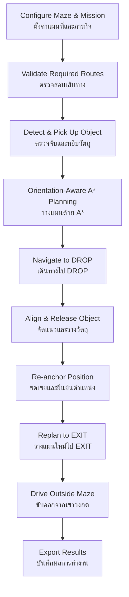
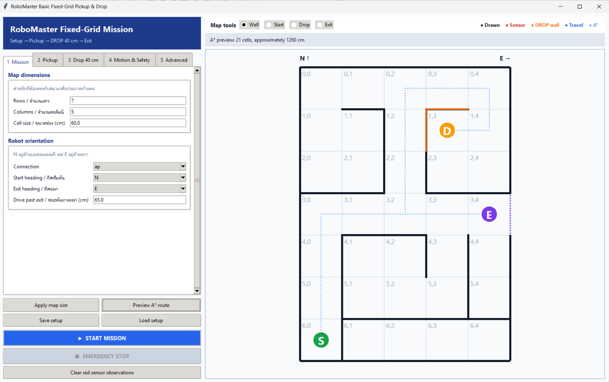
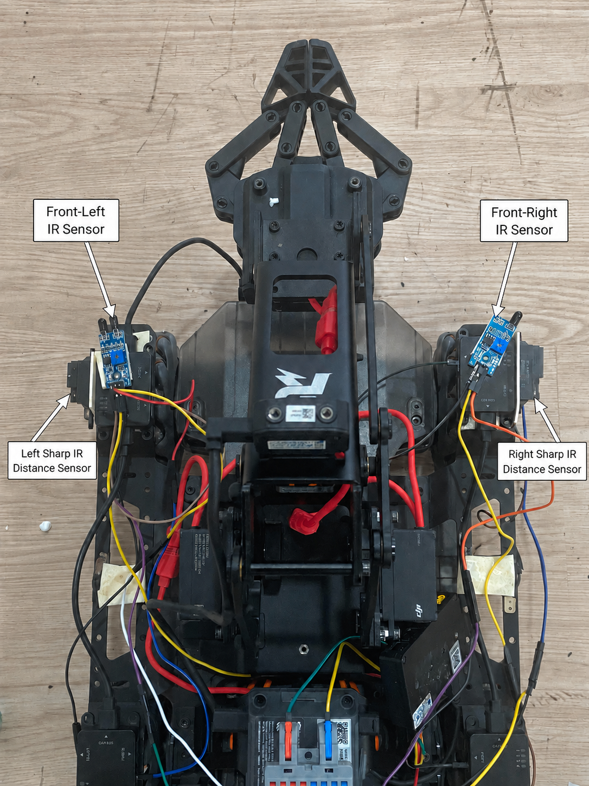
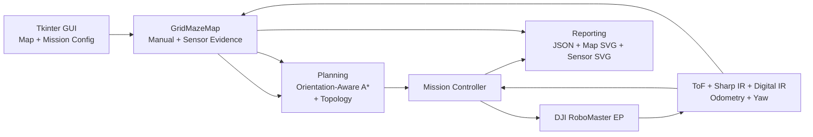
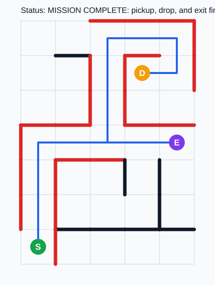
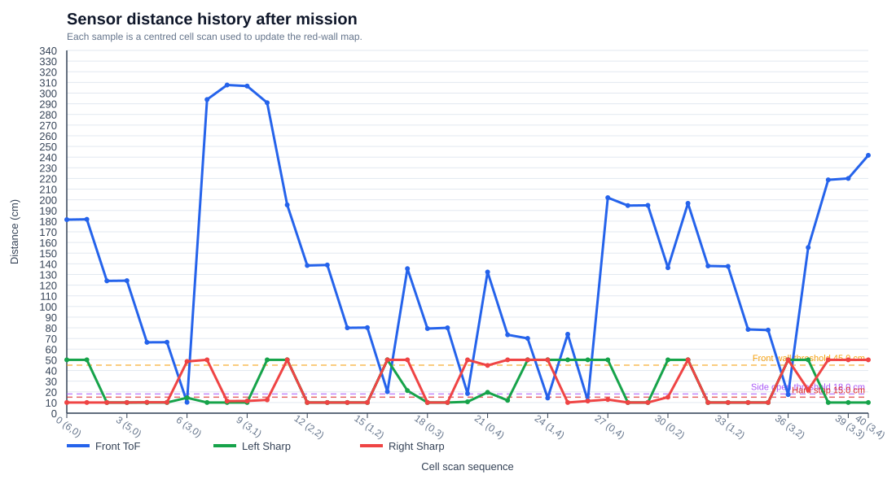

# RoboMaster Autonomous Maze Navigation

> **DJI RoboMaster EP autonomous fixed-grid maze navigation, object pickup, precise drop-off, and safe exit using A*, odometry, yaw feedback, ToF, Sharp IR, and persistent wall evidence.**
>
> **ระบบนำทางเขาวงกตอัตโนมัติสำหรับ DJI RoboMaster EP แบบ Fixed Grid พร้อมการหยิบวัตถุ วางวัตถุในตำแหน่งที่กำหนด และออกจากเขาวงกตอย่างปลอดภัย โดยใช้ A*, Odometry, Yaw Feedback, ToF, Sharp IR และระบบจดจำหลักฐานกำแพง**

<p align="center">
  <a href="https://github.com/SIRP00M/RoboMaster-NavMap"></a>
  <a href="https://youtu.be/44vI4HtLeyQ"></a>
  
  
</p>

<p align="center">
  <b>Repository:</b> <a href="https://github.com/SIRP00M/RoboMaster-NavMap">SIRP00M/RoboMaster-NavMap</a>
  &nbsp;•&nbsp;
  <b>Demo Video:</b> <a href="https://youtu.be/44vI4HtLeyQ">YouTube</a>
</p>

---

## Team Members / สมาชิกในทีม

| English Name | ชื่อภาษาไทย |
|---|---|
| **Phum Khongkaeo** | **ภูมิ คงแก้ว** |
| **Nattanon Srasri** | **ณัฐนนท์ สระศรี** |
| **Ratchanon Chimyai** | **รัชชานนท์ ฉิมใหญ่** |
| **Rusnanee Madeng** | **รุสนานี มะเด็ง** |

---

## Table of Contents / สารบัญ

- [Project Overview / ภาพรวมโครงการ](#project-overview--ภาพรวมโครงการ)
- [Demo / วิดีโอตัวอย่าง](#demo--วิดีโอตัวอย่าง)
- [Mission Workflow / ลำดับการทำงาน](#mission-workflow--ลำดับการทำงาน)
- [Core Features / ความสามารถหลัก](#core-features--ความสามารถหลัก)
- [GUI Mission Configuration / การตั้งค่าภารกิจผ่าน-gui](#gui-mission-configuration--การตั้งค่าภารกิจผ่าน-gui)
- [Hardware and Sensors / ฮาร์ดแวร์และเซนเซอร์](#hardware-and-sensors--ฮาร์ดแวร์และเซนเซอร์)
- [Navigation and Control Architecture / สถาปัตยกรรมการนำทางและควบคุม](#navigation-and-control-architecture--สถาปัตยกรรมการนำทางและควบคุม)
- [Wall Evidence System / ระบบหลักฐานกำแพง](#wall-evidence-system--ระบบหลักฐานกำแพง)
- [Project Structure / โครงสร้างโปรเจกต์](#project-structure--โครงสร้างโปรเจกต์)
- [Requirements / ความต้องการของระบบ](#requirements--ความต้องการของระบบ)
- [Installation / การติดตั้ง](#installation--การติดตั้ง)
- [Running the Application / การรันโปรแกรม](#running-the-application--การรันโปรแกรม)
- [Simulation Mode / โหมดจำลอง](#simulation-mode--โหมดจำลอง)
- [Legacy and Field-Test Code / โค้ด Legacy และ Field Test](#legacy-and-field-test-code--โค้ด-legacy-และ-field-test)
- [Sharp IR Calibration / การคาลิเบรต Sharp IR](#sharp-ir-calibration--การคาลิเบรต-sharp-ir)
- [Generated Results / ผลลัพธ์ที่บันทึก](#generated-results--ผลลัพธ์ที่บันทึก)
- [Testing / การทดสอบ](#testing--การทดสอบ)
- [Current Limitations / ข้อจำกัดปัจจุบัน](#current-limitations--ข้อจำกัดปัจจุบัน)
- [Safety / ความปลอดภัย](#safety--ความปลอดภัย)
- [Project Version / เวอร์ชันโปรเจกต์](#project-version--เวอร์ชันโปรเจกต์)
- [Repository](#repository)

---

## Project Overview / ภาพรวมโครงการ

### 🇹🇭 ภาษาไทย

โปรเจกต์นี้เป็นระบบ **Autonomous Maze Navigation และ Object Delivery** สำหรับ **DJI RoboMaster EP** โดยออกแบบให้หุ่นยนต์สามารถทำภารกิจตั้งแต่ต้นจนจบได้โดยอัตโนมัติ ได้แก่

1. ตรวจจับและหยิบวัตถุด้วยเซนเซอร์ด้านหน้าและแขนกล
2. คำนวณเส้นทางผ่านเขาวงกตแบบ Fixed Grid
3. เดินทางไปยังตำแหน่ง `DROP`
4. จัดแนวหุ่นยนต์และวางวัตถุให้สัมพันธ์กับกำแพงตามระยะที่กำหนด
5. คำนวณเส้นทางใหม่ไปยัง `EXIT`
6. ขับออกนอกเขาวงกต
7. บันทึกแผนที่ เส้นทางจริง ประวัติเซนเซอร์ และรายงานภารกิจ

ผู้ควบคุมกำหนดขนาดแผนที่ ขนาดช่อง กำแพงที่ทราบล่วงหน้า ตำแหน่ง `START`, `DROP`, `EXIT` รวมถึงค่าการเคลื่อนที่และค่าของเซนเซอร์ผ่าน **Tkinter GUI** ก่อนเริ่มภารกิจ

ระบบนำทางหลักใช้ **orientation-aware A\*** ร่วมกับ **wheel odometry**, **yaw feedback**, **front ToF**, **Sharp IR ด้านซ้าย/ขวา** และข้อมูลจาก **digital IR ด้านหน้า** เพื่อให้หุ่นยนต์เดินตามเส้นทาง แก้ไขแนวการวิ่ง หลีกเลี่ยงการชน และปรับแผนเมื่อข้อมูลกำแพงจริงไม่ตรงกับแผนที่ตั้งต้น

> **หมายเหตุ:** โหมดหลักออกแบบมาสำหรับเขาวงกตแบบ Fixed Grid ที่ทราบขนาดช่องล่วงหน้า และปัจจุบันไม่ได้ใช้กล้อง, SLAM, ROS 2 หรือระบบระบุตำแหน่งแบบ Absolute Localization

### 🇬🇧 English

This project is an **autonomous maze-navigation and object-delivery system** for the **DJI RoboMaster EP**. It is designed to complete an end-to-end mission automatically:

1. Detect and pick up an object.
2. Plan a route through a fixed-grid maze.
3. Navigate to the configured `DROP` cell.
4. Align the robot and place the object at the required wall-relative position.
5. Replan from `DROP` to `EXIT`.
6. Drive out of the maze.
7. Export the final map, travelled path, sensor history, and mission report.

Before movement begins, the operator configures the grid size, physical cell dimensions, known walls, `START`, `DROP`, `EXIT`, motion parameters, and sensor settings through a **Tkinter GUI**.

The primary navigation stack combines **orientation-aware A\*** with **wheel odometry**, **yaw feedback**, a **front ToF sensor**, **left/right Sharp IR sensors**, and **front digital IR sensors**. This allows the robot to follow the planned route, correct its motion, react to obstacles, and replan when live wall evidence differs from the initial map.

> **Note:** The primary mode is intended for a fixed grid with known cell dimensions. The current system does not rely on a camera, SLAM, ROS 2, or external absolute localization.

---

## Demo / วิดีโอตัวอย่าง

### 🇹🇭 ภาษาไทย

วิดีโอต่อไปนี้แสดงตัวอย่างภารกิจบนหุ่นยนต์จริง ตั้งแต่การหยิบวัตถุ การเดินทางในเขาวงกต การจัดตำแหน่งก่อนวางวัตถุ การปล่อยวัตถุ และการเดินทางไปยังทางออก

### 🇬🇧 English

The following video demonstrates a complete real-world mission, including object pickup, autonomous maze navigation, drop-position alignment, object release, and navigation to the exit.

<p align="center">
  <a href="https://youtu.be/44vI4HtLeyQ">
    
  </a>
</p>

<p align="center">
  ▶️ <b><a href="https://youtu.be/44vI4HtLeyQ">Watch the full mission demo on YouTube</a></b><br>
  <i>RoboMaster EP Autonomous Maze Navigation | A* Pickup & Drop Mission</i>
</p>


---

## Mission Workflow / ลำดับการทำงาน



### 🇹🇭 ขั้นตอนภารกิจ

1. ตั้งค่าจำนวนแถว/คอลัมน์ ขนาดช่อง กำแพง และตำแหน่งภารกิจใน GUI
2. ตรวจสอบว่ามีเส้นทาง `START → DROP` และ `DROP → EXIT`
3. ตรวจจับวัตถุ เข้าหาวัตถุ หยิบ และตรวจสอบว่าหยิบสำเร็จด้วย ToF
4. สร้างเส้นทางด้วย orientation-aware A\*
5. เดินตามเส้นทางด้วย odometry, yaw feedback, obstacle detection และ side-wall correction
6. จัดแนววัตถุกับกำแพงด้านหน้า/ด้านข้างตามค่าที่กำหนด
7. ลดแขนและปล่อยวัตถุ
8. ชดเชยการเคลื่อนที่ที่เกิดระหว่างขั้นตอน Drop และ re-anchor ตำแหน่งหุ่นยนต์
9. วางแผนเส้นทางใหม่จาก `DROP` ไป `EXIT`
10. ขับพ้นขอบเขตเขาวงกตและส่งออกผลลัพธ์การทดลอง

### 🇬🇧 Mission Steps

1. Configure grid dimensions, physical cell size, known walls, and mission markers in the GUI.
2. Validate that routes exist from `START → DROP` and `DROP → EXIT`.
3. Detect, approach, grasp, and verify the object using the front ToF sensor.
4. Generate an orientation-aware A\* route.
5. Follow the route using odometry, yaw feedback, obstacle detection, and side-wall correction.
6. Align the carried object with the configured front and side wall distances.
7. Lower the arm and release the object.
8. Compensate for drop-alignment movement and re-anchor the robot position.
9. Replan from `DROP` to `EXIT`.
10. Drive beyond the maze boundary and export the mission artifacts.

---

## Core Features / ความสามารถหลัก

| Feature | รายละเอียดภาษาไทย | English Description |
|---|---|---|
| GUI Map Editor | วาดแผนที่ Fixed Grid และกำแพงผ่าน GUI | Visual fixed-grid maze editor |
| Mission Markers | กำหนด `START`, `DROP`, `EXIT` | Configurable `START`, `DROP`, and `EXIT` cells |
| Route Validation | ตรวจสอบเส้นทางก่อนเริ่มเคลื่อนที่จริง | Pre-run route validation |
| Orientation-Aware A* | คิดต้นทุนของการเลี้ยวร่วมกับระยะทาง | A* planning with heading and turn cost |
| Automatic Replanning | วางแผนใหม่เมื่อพบข้อมูลกำแพงที่เปลี่ยนไป | Replanning when updated wall evidence blocks a route |
| Trémaux / DFS Fallback | มีโหมดสำรวจสำรองสำหรับเส้นทางที่ไม่แน่นอน | Exploration fallback using Trémaux-style / DFS logic |
| Wheel Odometry | ประเมินระยะเคลื่อนที่จาก odometry ของ RoboMaster | Cell/corridor progress from wheel odometry |
| Yaw Feedback | รักษาทิศและหมุนแบบ closed loop | Heading hold and closed-loop turning |
| Front ToF | ตรวจวัตถุ หยุดฉุกเฉิน และจัดระยะแนวหน้า | Object detection, safety stop, and front-wall alignment |
| Sharp IR | ควบคุมระยะห่างกำแพงด้านซ้าย/ขวา | Left/right wall-distance control |
| Digital Front IR | ป้องกันการชนบริเวณมุมด้านหน้าหุ่นยนต์ | Front-corner collision sensing |
| Arm & Gripper | หยิบ เคลื่อนย้าย และวางวัตถุ | Pickup and drop using robotic arm and gripper |
| Sensor Offset Compensation | ชดเชยตำแหน่งติดตั้งเซนเซอร์กับศูนย์กลางวัตถุ | Converts object-to-wall targets into sensor targets |
| Persistent Wall Evidence | ลดปัญหากำแพงหาย/เกิดผิดจากค่าที่อ่านครั้งเดียว | Persistent wall evidence reduces isolated false readings |
| Traversed-Edge Protection | เส้นทางที่หุ่นยนต์วิ่งผ่านแล้วถือเป็นหลักฐานพื้นที่เปิดที่แข็งแรง | Physically traversed edges are preserved as strong open evidence |
| Result Export | ส่งออก JSON, final-map SVG และ sensor-graph SVG | JSON, final-map SVG, and sensor-graph SVG export |
| Simulation | ทดสอบ logic ได้โดยไม่ต้องต่อหุ่นยนต์ | Hardware-independent mission simulation |
| Unit Tests | ทดสอบ wall evidence และ artifact export | Automated wall-evidence and artifact tests |

---

## GUI Mission Configuration / การตั้งค่าภารกิจผ่าน GUI

### 🇹🇭 ภาษาไทย

GUI ทำหน้าที่เป็นทั้ง **Map Editor**, **Mission Configurator** และ **Mission Monitor** โดยสามารถตั้งค่าได้ เช่น

- จำนวนแถวและคอลัมน์ของ Grid
- ขนาดจริงของแต่ละช่อง (cm)
- ตำแหน่ง `START`, `DROP`, `EXIT`
- กำแพงที่ทราบล่วงหน้า
- ทิศเริ่มต้นและทิศทางออก
- ความเร็วและ Safety Threshold
- ค่าการหยิบวัตถุ
- ค่าการวางวัตถุ
- ระยะจากวัตถุถึงกำแพง
- Offset ระหว่าง ToF / Sharp IR กับตำแหน่งวัตถุ
- ไฟล์ Calibration ของ Sharp IR
- การทำงานแบบ Simulation หรือ Real Robot

### 🇬🇧 English

The GUI acts as the **map editor**, **mission configurator**, and **mission monitor**. It allows the operator to configure:

- Grid rows and columns
- Physical cell size
- `START`, `DROP`, and `EXIT` cells
- Known maze walls
- Initial and exit heading
- Motion speeds and safety thresholds
- Pickup parameters
- Drop parameters
- Object-to-wall target distances
- ToF / Sharp IR mounting offsets
- Optional Sharp IR calibration files
- Simulation or real-robot operation

<p align="center">
  <a href="docs/images/gui/mission-control-gui.png">
    
  </a>
</p>
<p align="center"><i>Mission configuration, maze editor, route preview, and live mission monitor / หน้าตั้งค่าภารกิจ แผนที่ และติดตามการทำงาน</i></p>

---

## Hardware and Sensors / ฮาร์ดแวร์และเซนเซอร์

### Required Hardware / ฮาร์ดแวร์หลัก

- **DJI RoboMaster EP**
- **RoboMaster robotic arm and gripper**
- **Front Time-of-Flight (ToF) distance sensor**
- **Left Sharp IR distance sensor**
- **Right Sharp IR distance sensor**
- **Front-left digital IR sensor**
- **Front-right digital IR sensor**
- RoboMaster wheel odometry
- RoboMaster attitude / yaw feedback

### Sensor Layout — Top View / ตำแหน่งเซนเซอร์มุมมองด้านบน

ภาพด้านบนแสดงตำแหน่ง digital IR ด้านหน้าซ้าย/ขวาและ Sharp IR ด้านข้างทั้งสองฝั่ง  
The top view shows the two front digital IR sensors and the left/right side-facing Sharp IR sensors.

<p align="center">
  <a href="docs/images/robot/robomaster-sensors-top-view.png">
    
  </a>
</p>
<p align="center"><i>Top-view sensor layout / ตำแหน่งเซนเซอร์มุมมองด้านบน</i></p>

### Front ToF View / เซนเซอร์ ToF ด้านหน้า

ToF ด้านหน้าใช้สำหรับตรวจวัตถุ ช่วยยืนยันการหยิบ หยุดก่อนชน และจัดตำแหน่งกับกำแพงระหว่างขั้นตอน Drop  
The front ToF sensor is used for object detection, pickup verification, obstacle stopping, and front-wall alignment during the drop sequence.

<p align="center">
  <a href="docs/images/robot/robomaster-front-tof-view.png">
    
  </a>
</p>
<p align="center"><i>Front ToF sensor and robot front view / เซนเซอร์ ToF และมุมมองด้านหน้าหุ่นยนต์</i></p>

### Sensor Adapter Configuration / การกำหนด Sensor Adapter

ค่าปัจจุบันถูกกำหนดใน `robomaster_mission/mission.py`  
The current values are defined in `robomaster_mission/mission.py`.

| Sensor | Adapter ID | Port | Purpose / หน้าที่ |
|---|---:|---:|---|
| Front-left digital IR | `1` | `1` | Detect close obstacles on the front-left / ตรวจสิ่งกีดขวางด้านหน้าซ้าย |
| Front-right digital IR | `4` | `1` | Detect close obstacles on the front-right / ตรวจสิ่งกีดขวางด้านหน้าขวา |
| Left Sharp IR | `2` | `1` | Left-wall distance / วัดระยะกำแพงซ้าย |
| Right Sharp IR | `3` | `1` | Right-wall distance / วัดระยะกำแพงขวา |

> **Important / สำคัญ:** ตรวจสอบ Adapter ID, Port, polarity และการต่อสายกับหุ่นยนต์จริงทุกครั้งก่อนเริ่มภารกิจจริง  
> Always verify sensor IDs, ports, polarity, and physical wiring before a real run.

---

## Navigation and Control Architecture / สถาปัตยกรรมการนำทางและควบคุม



### High-Level Planning / การวางแผนระดับสูง

- `planning.py` ใช้ **orientation-aware A\*** เพื่อเลือกเส้นทางโดยพิจารณาทั้งระยะทางและต้นทุนการเลี้ยว
- ระบบสามารถสร้าง topological representation ของทางเดิน โดยลด straight corridor ให้เป็น edge ระหว่างจุดตัด มุม หรือ dead-end
- หากข้อมูลกำแพงจากเซนเซอร์ทำให้เส้นทางเดิมใช้ไม่ได้ สามารถทำการ replan ได้

`planning.py` uses **orientation-aware A\*** so route cost can account for both travel distance and turning. The planner also contains a topological representation that compresses straight corridors into edges between decision points such as junctions, corners, and dead ends. Updated wall evidence can trigger replanning.

### Low-Level Motion Control / การควบคุมการเคลื่อนที่ระดับล่าง

- **Wheel odometry** ใช้วัดความคืบหน้าในการเคลื่อนที่
- **Yaw feedback** ใช้รักษาทิศและหมุนแบบ feedback control
- **Front ToF** ใช้ตรวจระยะด้านหน้าและ emergency stop
- **Sharp IR** ใช้แก้ระยะด้านข้างและช่วยตรวจรูปแบบทางเดิน
- **Digital IR** ช่วยป้องกันการชนมุมด้านหน้า

Wheel odometry provides travelled-distance feedback, yaw feedback maintains the required heading, the front ToF provides front-distance safety and alignment, Sharp IR sensors provide lateral wall information, and the front digital IR sensors provide close-range collision protection.

### Main Software Modules / โมดูลหลัก

| Module | Responsibility / หน้าที่ |
|---|---|
| `main.py` | Application entry point and command-line mode selection / จุดเริ่มโปรแกรม |
| `robomaster_mission/configuration.py` | Mission parameters, validation, direction helpers, drop-target calculations / ค่าภารกิจและตรวจสอบค่าตั้งต้น |
| `robomaster_mission/grid_map.py` | Fixed-grid map, manual walls, sensor evidence, paths / แผนที่และหลักฐานกำแพง |
| `robomaster_mission/planning.py` | Orientation-aware A* and topological planning / วางแผนเส้นทาง |
| `robomaster_mission/mission.py` | Sensor input, motion control, pickup, navigation, drop, exit / ควบคุมภารกิจจริง |
| `robomaster_mission/reporting.py` | JSON, map SVG, sensor-history SVG generation / ส่งออกผลการทดลอง |
| `robomaster_mission/gui.py` | Tkinter map editor and live mission monitor / GUI และหน้าติดตามภารกิจ |
| `robomaster_mission/version.py` | Program/result compatibility version / เวอร์ชันโปรแกรมและไฟล์ผลลัพธ์ |

---

## Wall Evidence System / ระบบหลักฐานกำแพง

### 🇹🇭 ภาษาไทย

ระบบแยก **กำแพงที่ผู้ใช้วาด (manual walls)** ออกจาก **กำแพงที่ตรวจพบจากเซนเซอร์ (sensor walls)** เพื่อไม่ให้ข้อมูลจากเซนเซอร์ที่ผิดพลาดเพียงครั้งเดียวทำลายแผนที่เดิม

หลักการสำคัญ:

- เมื่อเซนเซอร์รายงานว่า **Blocked** ระบบสามารถเพิ่มกำแพงได้ทันทีเพื่อความปลอดภัย
- เมื่อเซนเซอร์รายงานว่า **Open** จะต้องพบสถานะเปิดต่อเนื่องหลายครั้งก่อนลบกำแพงที่เคยตรวจพบ
- ใน implementation ปัจจุบันใช้ **3 consecutive open confirmations** ก่อนลบ sensor wall
- หากหุ่นยนต์เคย **วิ่งผ่าน edge นั้นจริง** edge จะถูกบันทึกเป็น strong open evidence
- Strong traversed-open evidence ช่วยป้องกันกรณี Sharp IR อ่านมุมกำแพงผิดแล้วปิดทางที่หุ่นยนต์เคยผ่านแล้ว
- เมื่อแก้ manual wall ระบบจะล้าง topology memory ที่อาจไม่สัมพันธ์กับโครงสร้างแผนที่ใหม่

### 🇬🇧 English

The map separates **operator-defined manual walls** from **sensor-detected walls** so that a single noisy reading does not immediately destroy previously useful map information.

Key behaviour:

- A **blocked** sensor observation can add a wall immediately for safety.
- An **open** observation must be repeated before a previously detected sensor wall is removed.
- The current implementation requires **3 consecutive open confirmations**.
- An edge the robot has **physically traversed** is stored as strong open-space evidence.
- Traversed-open protection prevents an angled Sharp IR reading near a corner from incorrectly closing a route already crossed by the robot.
- Editing manual walls invalidates topology memory that may belong to the previous maze structure.

---

## Project Structure / โครงสร้างโปรเจกต์

โครงสร้างหลักของ repository ปัจจุบัน / Current main repository layout:

```text
RoboMaster-NavMap/
├── main.py
├── README.md
├── requirements.txt
├── .gitignore
│
├── robomaster_mission/
│   ├── __init__.py
│   ├── configuration.py
│   ├── grid_map.py
│   ├── planning.py
│   ├── mission.py
│   ├── reporting.py
│   ├── version.py
│   └── gui.py
│
├── tests/
│   └── test_wall_evidence.py
│
├── docs/
│   ├── images/
│   │   ├── gui/
│   │   │   └── mission-control-gui.png
│   │   └── robot/
│   │       ├── robomaster-front-tof-view.png
│   │       └── robomaster-sensors-top-view.png
│   └── results/
│       └── run-20260827-111035/
│           ├── robomaster_basic_maze_run_20260827_111035.json
│           ├── robomaster_basic_maze_run_20260827_111035_map.svg
│           └── robomaster_basic_maze_run_20260827_111035_sensor_graph.svg
│
└── field test/
    └── New Method with map as guidance/
        ├── Hybrid/
        ├── maze_designer_tool/
        ├── maze_designer.py
        └── maze_monster_v12_5_field_ready.py
```

### Folder Notes / หมายเหตุเกี่ยวกับโฟลเดอร์

- `robomaster_mission/` — โค้ดหลักแบบ modular / main modular implementation
- `tests/` — automated tests ที่ไม่ต้องใช้ hardware จริง / hardware-independent tests
- `docs/` — รูปประกอบ เอกสาร และตัวอย่างผลการทดลอง / documentation images and selected run artifacts
- `field test/` — โค้ดทดลอง, maze-design utilities และ field-ready/legacy builds ที่ใช้ระหว่างการพัฒนา / experimental, maze-design, and field-test builds retained during development

---

## Requirements / ความต้องการของระบบ

### Software / ซอฟต์แวร์

- Windows 10 or Windows 11
- Python **3.10 recommended**
- `pip`
- DJI RoboMaster Python SDK
- Tkinter (included in standard Windows Python installations)

### Real-Robot Operation / การใช้งานกับหุ่นยนต์จริง

- DJI RoboMaster EP
- Network connection to the robot using **AP**, **STA**, or **RNDIS** mode
- Correct sensor adapter wiring and IDs
- Calibrated Sharp IR sensors

### RoboMaster SDK

สำหรับ Python เวอร์ชันใหม่ RoboMaster SDK อาจติดตั้งจาก PyPI โดยตรงไม่ได้ แนะนำให้ใช้ dependency จาก GitHub:  
For newer Python versions, the RoboMaster SDK may not install normally from PyPI. The recommended dependency is:

```text
robomaster @ https://github.com/dji-sdk/RoboMaster-SDK/archive/refs/heads/master.zip
```

---

## Installation / การติดตั้ง

### 1. Clone Repository / ดาวน์โหลด Repository

```powershell
git clone https://github.com/SIRP00M/RoboMaster-NavMap.git
cd RoboMaster-NavMap
```

### 2. Create Virtual Environment / สร้าง Virtual Environment

#### PowerShell

```powershell
py -3.10 -m venv .venv
Set-ExecutionPolicy -Scope Process -ExecutionPolicy Bypass
.\.venv\Scripts\Activate.ps1
```

#### Command Prompt

```cmd
py -3.10 -m venv .venv
.venv\Scripts\activate.bat
```

### 3. Install Dependencies / ติดตั้ง Dependencies

```powershell
python -m pip install --upgrade pip setuptools wheel
python -m pip install -r requirements.txt
```

### 4. Verify RoboMaster SDK / ตรวจสอบ SDK

```powershell
python -c "from robomaster import robot; print('RoboMaster SDK OK')"
```

หากขึ้น `RoboMaster SDK OK` แสดงว่า Python สามารถ import SDK ได้สำเร็จ  
If `RoboMaster SDK OK` is printed, the SDK can be imported successfully.

---

## Running the Application / การรันโปรแกรม

เปิด Terminal ที่ project root แล้วรัน / From the project root, run:

```powershell
python main.py
```

โดยปกติ `main.py` จะเปิด **HybridMazeGUI** เพื่อให้ตั้งค่าแผนที่และภารกิจ  
By default, `main.py` starts the **HybridMazeGUI** mission editor and monitor.

### Checklist Before a Real Run / ตรวจสอบก่อนวิ่งจริง

1. ตรวจ Sensor Adapter ID และ Port / Verify all sensor IDs and ports.
2. ตรวจค่าคาลิเบรต Sharp IR ซ้ายและขวา / Verify left/right Sharp IR calibration.
3. ตั้งค่าขนาด Grid และ `START`, `DROP`, `EXIT` / Configure grid and mission markers.
4. ตรวจ pickup, drop, motion และ safety parameters / Review pickup, drop, motion, and safety parameters.
5. Validate route ใน GUI / Validate the required routes.
6. วางหุ่นยนต์ตรงตำแหน่งและ heading ที่กำหนด / Place the robot at the configured start pose.
7. เตรียมหยุดหุ่นยนต์ได้ทันทีหากเกิดความผิดปกติ / Keep an emergency-stop method accessible.

---

## Simulation Mode / โหมดจำลอง

### 🇹🇭 ภาษาไทย

สามารถทดสอบ GUI, planner, map logic และ result export โดยไม่เชื่อมต่อ RoboMaster จริงได้

1. รัน `python main.py`
2. เปิด `Simulation` ใน GUI
3. ตั้งค่า Grid, กำแพง และ mission markers
4. Validate ภารกิจ
5. เริ่ม Simulation

Simulation เหมาะสำหรับตรวจ logic และการเชื่อมต่อของแต่ละโมดูล แต่ **ไม่จำลองฟิสิกส์จริงของหุ่นยนต์** เช่น wheel slip, ความคลาดเคลื่อนตอนเลี้ยว, sensor noise หรือ communication delay

### 🇬🇧 English

The GUI, planner, map logic, and result exporters can be tested without a physical robot:

1. Run `python main.py`.
2. Enable `Simulation` in the GUI.
3. Configure the grid, walls, and mission markers.
4. Validate the mission.
5. Start the simulation.

Simulation validates the mission logic and data flow, but it **does not model real robot physics**, wheel slip, turning error, sensor noise, or communication delay.

---

## Legacy and Field-Test Code / โค้ด Legacy และ Field Test

### Legacy Mode

โหมดสำรวจเดิมสามารถเรียกจาก `main.py` ได้ด้วย / The original exploration mode can be started with:

```powershell
python main.py --legacy
```

Legacy mode ต้องใช้ RoboMaster SDK และหุ่นยนต์จริงที่เชื่อมต่ออยู่  
Legacy mode requires the RoboMaster SDK and a connected physical robot.

### Field-Test / Experimental Builds

Repository ยังเก็บโค้ดทดลองภายใต้ `field test/` เพื่อใช้เปรียบเทียบและทดสอบวิธีนำทางระหว่างการพัฒนา เช่น known-map/hybrid experiments, maze designer tools และ standalone field-ready build

The repository also retains experimental code under `field test/`, including known-map/hybrid experiments, maze-design utilities, and a standalone field-ready build used during development.

ตัวอย่าง standalone build / Example standalone build:

```text
field test/New Method with map as guidance/maze_monster_v12_5_field_ready.py
```

ไฟล์ดังกล่าวเป็น single-file build ที่เก็บองค์ประกอบสำคัญไว้ในไฟล์เดียวเพื่อให้แก้ไขหน้างานได้ง่าย ในขณะที่โค้ดหลักของ repository ใช้โครงสร้าง modular ใน `robomaster_mission/`

That file is a single-file build intended for convenient field editing, while the main repository implementation is organized as modular code under `robomaster_mission/`.

---

## Sharp IR Calibration / การคาลิเบรต Sharp IR

Built-in calibration table / ตารางคาลิเบรตพื้นฐาน:

| ADC | Distance / ระยะ |
|---:|---:|
| 450 | 10 cm |
| 360 | 20 cm |
| 300 | 30 cm |
| 240 | 40 cm |
| 200 | 50 cm |

### Calibration Notes / หมายเหตุ

- วัดระยะจาก **หน้าเลนส์ Sharp IR ถึงกำแพงโดยตรง** ไม่ใช่จากจุดศูนย์กลางหุ่นยนต์
- ควรคาลิเบรตเซนเซอร์ซ้ายและขวาแยกกัน
- GUI รองรับ optional JSON calibration files สำหรับเซนเซอร์แต่ละด้าน
- ค่าจาก Sharp IR อาจเปลี่ยนตามสี พื้นผิว มุมสะท้อน และตำแหน่งติดตั้งของกำแพง

Calibration distances should be measured directly from the **Sharp sensor lens to the wall**, not from the robot centre. Calibrate left and right sensors independently. Optional JSON calibration files can be selected through the GUI, and real measurements may vary with wall surface, angle, reflectivity, and mounting geometry.

---

## Generated Results / ผลลัพธ์ที่บันทึก

หลังจบ Simulation หรือ Real Mission โปรแกรมสามารถส่งออกไฟล์หลัก 3 ประเภท:  
After a simulation or real mission, the application can generate three main artifact types:

| Output | Contents / ข้อมูล |
|---|---|
| `*_run_YYYYMMDD_HHMMSS.json` | Mission configuration, map state, wall evidence, travelled path, status, sensor history / ค่าภารกิจ แผนที่ กำแพง เส้นทาง และข้อมูลเซนเซอร์ |
| `*_map.svg` | Final maze, walls, route, robot trajectory / แผนที่ กำแพง เส้นทาง และ trajectory |
| `*_sensor_graph.svg` | Front ToF + left/right Sharp IR history / กราฟข้อมูลเซนเซอร์ตามเวลา |

ไฟล์ run ที่สร้างระหว่างการทดลองควรถูก ignore จาก Git และเลือกเฉพาะ run ที่สำเร็จหรือมีความสำคัญไปเก็บใน `docs/results/` สำหรับการนำเสนอ  
Generated run files should normally remain ignored by Git, while selected successful runs can be copied into `docs/results/` for documentation and portfolio use.

### Sample Real-World Mission Result / ตัวอย่างผลการทดสอบจริง

ตัวอย่างด้านล่างมาจาก completed physical-robot mission วันที่ **27 August 2026**  
The following artifacts are from a completed physical-robot mission on **August 27, 2026**.

#### Final Maze and Robot Trajectory / แผนที่และเส้นทางจริง

<p align="center">
  <a href="docs/results/run-20260827-111035/robomaster_basic_maze_run_20260827_111035_map.svg">
    
  </a>
</p>

#### Sensor Distance History / ประวัติระยะจากเซนเซอร์

<p align="center">
  <a href="docs/results/run-20260827-111035/robomaster_basic_maze_run_20260827_111035_sensor_graph.svg">
    
  </a>
</p>

#### Raw Mission Data / ข้อมูลดิบ

[Open the JSON mission report](docs/results/run-20260827-111035/robomaster_basic_maze_run_20260827_111035.json)

---

## Testing / การทดสอบ

รัน automated tests จาก project root / Run the hardware-independent unit tests from the project root:

```powershell
python -m unittest discover -s tests -v
```

### Current Test Coverage / สิ่งที่ทดสอบในปัจจุบัน

- Open reading เพียงครั้งเดียวจะไม่ลบกำแพงที่ยืนยันแล้ว  
  A single open reading does not remove a confirmed sensor wall.
- Open reading ต่อเนื่อง 3 ครั้งสามารถลบ sensor wall ได้  
  Three consecutive open readings remove a sensor wall.
- Blocked reading จะ reset open-reading streak  
  A blocked reading resets the open-reading streak.
- Edge ที่หุ่นยนต์วิ่งผ่านจริงถือเป็น strong open evidence  
  A physically traversed edge is strong open-space evidence.
- Artifact export ต้องสร้างไฟล์ผลลัพธ์ครบ รวมถึง sensor graph  
  Artifact export includes the sensor graph output.

---

## Current Limitations / ข้อจำกัดปัจจุบัน

### 🇹🇭 ภาษาไทย

- โหมดหลักสมมติว่าเขาวงกตเป็น Fixed Grid ที่ทราบขนาดช่องล่วงหน้า
- ความแม่นยำของตำแหน่งยังขึ้นกับ wheel odometry และได้รับผลจาก wheel slip
- Sharp IR ไวต่อ calibration, มุมกำแพง, ระยะติดตั้ง และพื้นผิว
- Simulation เป็น logical simulation ไม่ใช่ physics simulation
- ปัจจุบันยังไม่ได้ใช้ camera, SLAM, ROS 2 หรือ absolute localization
- การใช้งานจริงต้องทดสอบกับสนาม หุ่นยนต์ และวัตถุจริงทุกครั้ง
- ค่า sensor threshold และ motion parameter ที่เหมาะสมอาจแตกต่างตามสภาพสนามจริง

### 🇬🇧 English

- The primary mode assumes a fixed grid with known cell dimensions.
- Localization accuracy depends on wheel odometry and can be affected by wheel slip.
- Sharp IR behaviour depends on calibration, wall angle, mounting geometry, and surface properties.
- Simulation is a logical mission simulation rather than a full physics simulator.
- The current system does not use a camera, SLAM, ROS 2, or absolute localization.
- Real-world performance must be validated on the target robot, maze, and object.
- Sensor thresholds and motion parameters may require tuning for each physical field setup.

---

## Safety / ความปลอดภัย

> [!WARNING]
> This project controls a **physical mobile robot**. Always test at low speed first, keep the operating area clear, verify emergency-stop behaviour, and remain ready to stop the robot during every real-world test.

### 🇹🇭 ข้อแนะนำด้านความปลอดภัย

- เริ่มทดสอบด้วยความเร็วต่ำ
- ตรวจพื้นที่ให้ไม่มีคนหรือสิ่งของที่อาจเสียหาย
- ตรวจสายเซนเซอร์และ Sensor Adapter ก่อนเปิดภารกิจจริง
- ทดสอบ emergency stop ก่อนทุก field test
- อย่ายืนขวางแนวการเคลื่อนที่ของหุ่นยนต์
- เฝ้าดูหุ่นยนต์ตลอดระหว่างการทดลองจริง
- หากเซนเซอร์ให้ค่าผิดปกติ ให้หยุดภารกิจและตรวจ hardware ก่อนทดสอบต่อ

---

## Project Version / เวอร์ชันโปรเจกต์

Current modular mission compatibility version / เวอร์ชันของระบบ modular ปัจจุบัน:

```text
BASIC_FIXED_GRID_ASTAR_PICKUP_DROP_V7_PERSISTENT_WALL_EVIDENCE
```

A separate standalone field-test build is also retained in the repository as:

```text
V12.5_FIELD_READY_TOPO_GUIDE_V2
```

> The two version strings refer to different development branches/build formats: the main modular fixed-grid pickup/drop application and the standalone field-test maze build.

---

## Repository

**GitHub Repository / ซอร์สโค้ดและเอกสาร**

- **Main repository:** [SIRP00M/RoboMaster-NavMap](https://github.com/SIRP00M/RoboMaster-NavMap)
- **Clone:** `git clone https://github.com/SIRP00M/RoboMaster-NavMap.git`
- **Demo video:** [RoboMaster EP Autonomous Maze Navigation | A* Pickup & Drop Mission](https://youtu.be/44vI4HtLeyQ)

> Images in this README use repository-relative paths under `docs/images/` and `docs/results/`, so they render directly on GitHub as long as those files remain in the same folders.

---

## Acknowledgements / หมายเหตุ

This project uses the **DJI RoboMaster Python SDK** and was developed through repeated simulation, sensor calibration, unit testing, and physical field testing on the RoboMaster EP platform.

โปรเจกต์นี้พัฒนาโดยใช้ **DJI RoboMaster Python SDK** และผ่านการปรับปรุงจากการ Simulation, การคาลิเบรตเซนเซอร์, Unit Test และการทดสอบกับ RoboMaster EP ในสนามจริงอย่างต่อเนื่อง
